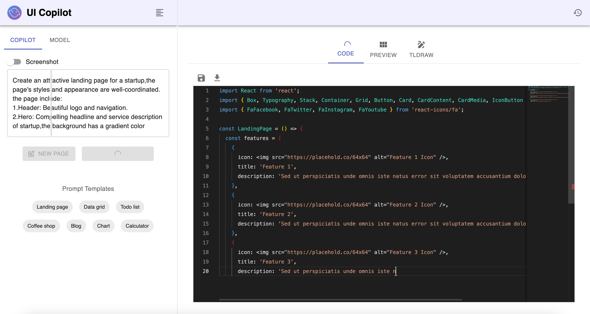
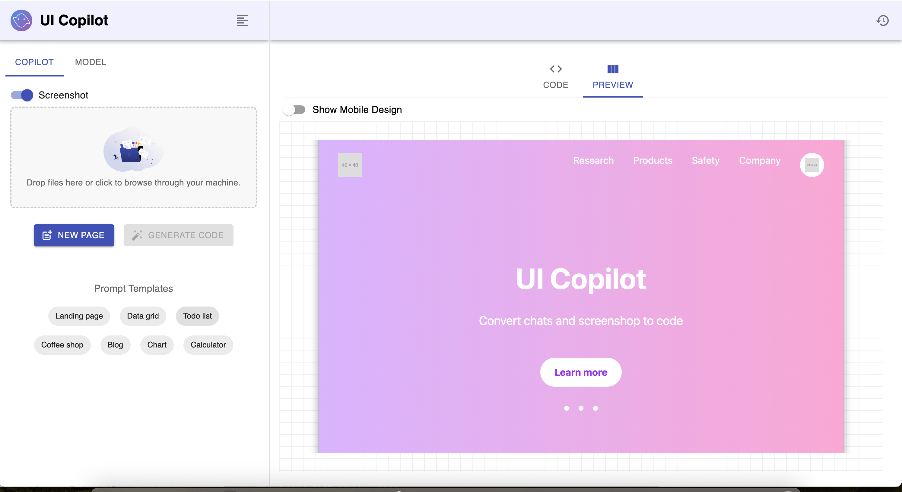
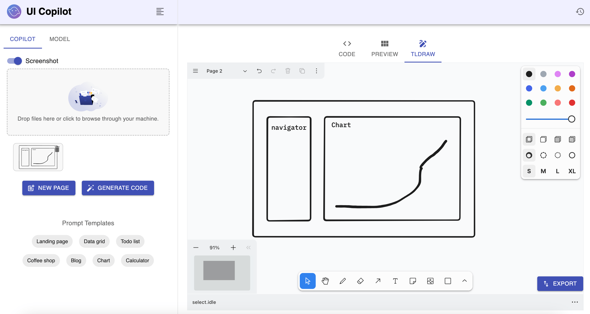

# ui-gen-gpt

A React and Vite-based tool with an Express backend that converts text, screenshots, and Figma designs into clean, functional code powered by LLMs. It employs a conversational approach for continuous page effect adjustments. Now supports AWS Bedrock and Claude 3.5 Sonnet.

### Text to code



### ScreenShot to code



### Tldraw to code



### Demo

https://github.com/user-attachments/assets/a77d428f-ce29-4f0a-b692-d983fdb02258

## Supported stacks:

- React + Mui
- React + Tailwind
- React + Mermaid
- React + Poltly

## Prerequisites

- Node.js (v18+)
- Docker (optional, recommended)
- Git (optional)
- Anthropic API key or AWS account credentials

## Setup

1. Clone the repository:

   ```shell
   git clone https://github.com/superyhee/ui-gen-gpt.git
   cd ui-code-generator
   ```

2. Configure API key:

   ```shell
   cd server
   cp .env.example .env
   ```

3. Edit .env:

   - Set ANTHROPIC_KEY or AWS AK and SK
   - Set IS_DOCKER_ENV to true for Docker, false otherwise

   ```shell
   IS_DOCKER_ENV=true
   ANTHROPIC_API_KEY=
   AWS_ACCESS_KEY_ID=
   AWS_SECRET_ACCESS_KEY=
   AWS_REGION=us-east-1
   ```

## Quick Start

### With Docker (Recommended)

In the root directory of the project:

```sh
docker-compose up -d --build
```

### Without Docker

In the root directory of the project, install dependencies and start the frontend and backend separately:

```sh
# Install frontend dependencies
cd frontend
npm install --legacy-peer-deps
npm run dev

# Install backend dependencies
cd ../server
npm install
npm run dev
```

Open your browser and visit http://localhost:9000 to see the frontend page.

## TODO

- [ ] Support for additional LLM APIs (e.g., GPT-4, Ollama)
- [ ] Extend component generation to Angular and other frontend frameworks

## Contributing

- Issues: Report bugs to help improve the project
- Feature Requests: Share your ideas for new features
- Security: Report vulnerabilities privately

## License

Licensed under the MIT License.
